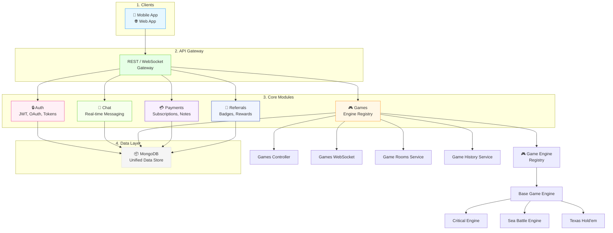

# Arcadeum Backend Architecture

## Overview

The Arcadeum backend is a NestJS-based microservice architecture designed to power a multi-game platform with real-time capabilities, user authentication, payments, and referral systems. The architecture follows a modular design with clear separation of concerns, making it scalable and maintainable.

## Core Architecture Principles

1. **Modular Design**: Each feature area (auth, chat, games, payments, referrals) is implemented as a separate module
2. **Layered Architecture**: Clear separation between controllers, services, repositories, and utilities
3. **Real-time Communication**: WebSocket-based communication for real-time game interactions
4. **Event-Driven**: Use of event emitters and message queues for asynchronous processing
5. **Type Safety**: Full TypeScript implementation with interfaces and DTOs for type safety
6. **Security First**: JWT authentication, role-based access control, and input validation

## Component Architecture

### 1. Authentication Module (`src/auth/`)

- **Controllers**: Handle HTTP endpoints for login, registration, and token refresh
- **Services**:
  - `AuthService`: Core authentication logic
  - `OAuthClientService`: Handles OAuth providers (Google)
  - `RefreshTokenService`: Manages refresh tokens
- **Strategies**:
  - `JwtStrategy`: JWT-based authentication
  - `GoogleOAuthStrategy`: Google OAuth2 integration
- **DTOs**:
  - `LoginDto`, `RegisterDto`, `RefreshTokenRequestDto`, `TokenExchangeDto`
- **Schemas**:
  - `UserSchema`: Mongoose schema for user data
  - `RefreshTokenSchema`: Mongoose schema for refresh tokens
- **Libraries**:
  - `roles.ts`: Defines user roles and permissions
  - `types.ts`: TypeScript interfaces for authentication types
  - `utils.ts`: Utility functions for token generation and validation

### 2. Chat Module (`src/chat/`)

- **Controller**: Handles HTTP endpoints for chat management
- **Gateway**: WebSocket gateway for real-time chat
- **Service**: Manages chat logic, message persistence, and notifications
- **DTOs**:
  - `ChatDto`, `CreateChatDto`, `MessageDto`
- **Schemas**:
  - `ChatSchema`: Mongoose schema for chat rooms
  - `MessageSchema`: Mongoose schema for chat messages
- **Helper Service**: `ChatHelperService` for utility functions

### 3. Games Module (`src/games/`) - Core Component

The games module is the most complex part of the backend, featuring a pluggable game engine architecture.

#### Game Engine Registry

- **GameEngineRegistry**: Central registry that manages all available game engines
- **BaseGameEngine**: Abstract base class defining the interface for all game engines
- **GameEngineInterface**: TypeScript interface defining required methods

#### Supported Game Engines

- **Critical**:
  - `CriticalEngine`: Main game logic implementation
  - `CriticalBotService`: AI opponent implementation
  - Utility classes for various game mechanics:
    - `CriticalAttackUtils`
    - `CriticalCancelUtils`
    - `CriticalChaosUtils`
    - `CriticalComboUtils`
    - `CriticalDeityUtils`
    - `CriticalFavorUtils`
    - `CriticalFutureUtils`
    - `CriticalLogicUtils`
    - `CriticalTheftUtils`
    - `CriticalValidationUtils`
- **Sea Battle**:
  - `SeaBattleEngine`: Implementation of the sea battle game
  - `SeaBattleService`: Service layer for Sea Battle
  - `SeaBattleBotService`: AI opponent for Sea Battle
- **Texas Hold'em**:
  - `TexasHoldemEngine`: Implementation of Texas Hold'em poker
  - `TexasHoldemService`: Service layer for Texas Hold'em
  - `TexasHoldemState`: Game state management

#### Game Management Components

- **GamesController**: HTTP endpoints for game management
- **GamesGateway**: WebSocket gateway for real-time game updates
- **GamesService**: Business logic for game creation, joining, and management
- **GamesRealtimeService**: Handles real-time game state synchronization
- **GamesRematchService**: Manages rematch functionality
- **GameRooms**:
  - `GameRoomsService`: Manages game room creation and state
  - `GameRoomsMapper`: Maps between domain objects and database entities
  - `GameRoomsQuery`: Database queries for game rooms
  - `GameRoomsRematchService`: Handles rematch-specific room logic
- **GameSessions**:
  - `GameSessionsService`: Manages game session lifecycle
- **History**:
  - `GameHistoryService`: Records and retrieves game history
  - `GameHistoryBuilderService`: Builds game history records
  - `GameHistoryStatsService`: Calculates game statistics
- **Utilities**:
  - `GameUtilitiesService`: Shared utility functions across games

#### Data Models

- `GameRoomSchema`: Mongoose schema for game rooms
- `GameSessionSchema`: Mongoose schema for game sessions
- `GameHistoryHiddenSchema`: Mongoose schema for hidden game history data

### 4. Payments Module (`src/payments/`)

- **Controller**: HTTP endpoints for payment operations
- **Service**: Manages payment processing logic
- **DTOs**:
  - `CreatePaymentDto`, `CreateSubscriptionDto`, `CreateNoteDto`
- **Schema**:
  - `PaymentNoteSchema`: Mongoose schema for payment notes
- **Interface**:
  - `PaymentSessionInterface`: TypeScript interface for payment session data
- **Service**:
  - `PaymentNotesService`: Manages payment notes and related data

### 5. Referrals Module (`src/referrals/`)

- **Controller**: HTTP endpoints for referral system
- **Service**: Manages referral logic, rewards, and tracking
- **Schemas**:
  - `ReferralSchema`: Mongoose schema for referral relationships
  - `ReferralRewardSchema`: Mongoose schema for referral rewards
- **BadgeController**: Manages referral badges and achievements

## Communication Flow

1. **HTTP Requests**: Clients make REST API calls to controllers
2. **WebSocket Connections**: Real-time game and chat interactions use WebSocket connections
3. **Service Layer**: Controllers delegate business logic to services
4. **Data Access**: Services interact with MongoDB via Mongoose models
5. **External Services**: Integration with third-party services (Google OAuth, payment processors)
6. **Event Handling**: Asynchronous events trigger background processing (e.g., notifications, analytics)

## Data Flow

```
Client → HTTP/WebSocket → Controller → Service → Repository → Database
              ↑                         ↓
              └─── External Services ←───┘
```

## Error Handling

- **Global Exception Filter**: `HttpExceptionFilter` catches and standardizes error responses
- **Message Code System**: `message-code.ts` defines standardized error codes and messages
- **Logger**: `ArcadeumLoggerService` provides structured logging throughout the application

## Security

- **Authentication**: JWT-based with refresh tokens
- **Authorization**: Role-based access control via `roles.ts`
- **Input Validation**: DTO validation using class-validator
- **Rate Limiting**: Implemented at the gateway level
- **Data Encryption**: Socket encryption utility for sensitive data transmission

## Scalability Considerations

1. **Stateless Services**: Authentication and game services are designed to be stateless
2. **Database Scaling**: MongoDB can be scaled horizontally with sharding
3. **WebSocket Scaling**: Can be distributed across multiple instances using Redis pub/sub
4. **Caching**: Potential for Redis caching of frequently accessed data
5. **Load Balancing**: Multiple instances can be deployed behind a load balancer

## Future Enhancements

1. **Microservices Split**: Consider splitting high-load components (games, payments) into separate services
2. **Message Queue**: Implement RabbitMQ or Kafka for asynchronous task processing
3. **Caching Layer**: Add Redis for caching game state and user data
4. **Analytics**: Integrate with analytics platforms for usage tracking
5. **Monitoring**: Add comprehensive monitoring with Prometheus and Grafana

## Documentation References

- [Games Architecture](../apps/be/src/games/ARCHITECTURE.md)
- [Games Final Architecture](../apps/be/src/games/FINAL-ARCHITECTURE.md)
- [Games Refactoring Plan](../apps/be/src/games/REFACTORING.md)

## Architecture Diagram



> 💡 _Render this diagram in any Markdown viewer that supports Mermaid (e.g., GitHub, VS Code with Mermaid plugin, Obsidian, or [Mermaid Live Editor](https://mermaid.live))._

> 📌 **Legend**:
>
> - 📱 **Clients**: Mobile and web applications
> - ⚙️ **API Gateway**: Handles HTTP/WebSocket requests
> - 🔒 **Modules**: Independent feature areas
> - 📦 **Data**: MongoDB as central persistence layer
