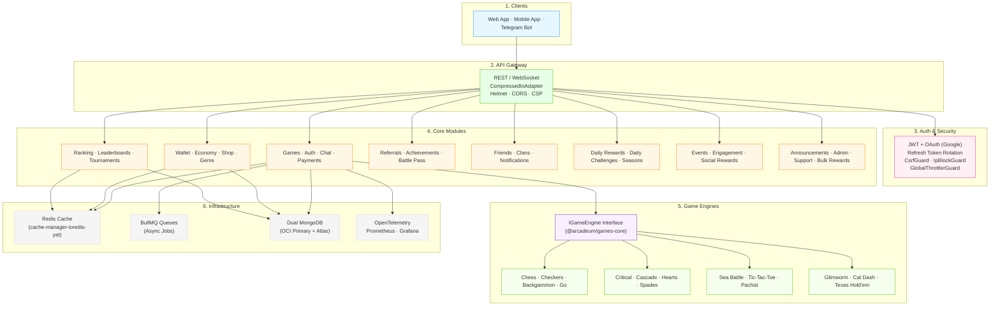

# Arcadeum Games Backend Architecture

## Overview

The Arcadeum Games backend is a **NestJS 11** microservice architecture designed to power a multi-game platform with real-time capabilities, user authentication, payments, virtual economy, and social features. The architecture follows a modular design with clear separation of concerns, making it scalable and maintainable.

## Core Architecture Principles

1. **Modular Design**: Each feature area is implemented as a separate NestJS module (27+ modules)
2. **Layered Architecture**: Clear separation between controllers, services, repositories, and utilities
3. **Real-time Communication**: WebSocket-based communication for real-time game interactions via Socket.IO with compression
4. **Event-Driven**: BullMQ job queues for asynchronous processing (Redis-backed)
5. **Type Safety**: Full TypeScript implementation with interfaces and DTOs for type safety
6. **Security First**: JWT authentication, role-based access control, CSRF protection, and input validation
7. **Observability**: OpenTelemetry tracing with Prometheus metrics and Grafana dashboards

## Component Architecture

### 1. Authentication Module (`src/auth/`)

- **Controllers**: Handle HTTP endpoints for login, registration, and token refresh
- **Services**:
  - `AuthService`: Core authentication logic
  - `OAuthClientService`: Handles OAuth providers (Google)
  - `RefreshTokenService`: Manages refresh tokens with rotation
- **Strategies**:
  - `JwtStrategy`: JWT-based authentication
  - `GoogleOAuthStrategy`: Google OAuth2 integration
- **DTOs**: `LoginDto`, `RegisterDto`, `RefreshTokenRequestDto`, `TokenExchangeDto`
- **Schemas**: `UserSchema`, `RefreshTokenSchema`
- **Guards**: JwtAuthGuard, optional auth for anonymous users
- **Features**: Anonymous user support (`anon_*` IDs), refresh token rotation, replay detection

### 2. Chat Module (`src/chat/`)

- **Controller**: HTTP endpoints for chat management
- **Gateway**: WebSocket gateway for real-time chat
- **Service**: Manages chat logic, message persistence, and notifications
- **DTOs**: `ChatDto`, `CreateChatDto`, `MessageDto`
- **Schemas**: `ChatSchema`, `MessageSchema`
- **Helper Service**: `ChatHelperService` for utility functions

### 3. Games Module (`src/games/`) — Core Component

The games module is the most complex part of the backend (97 files), featuring a pluggable game engine architecture.

#### Game Engine Registry

- **GameEngineRegistry**: Central registry that manages all available game engines
- **BaseGameEngine**: Abstract base class defining the interface for all game engines (from `@arcadeum/games-core`)
- **GameEngineInterface**: TypeScript interface defining required methods

#### Supported Game Engines

- **Board Games**: Chess, Checkers, Backgammon, Go, Tic-Tac-Toe, Pachisi, Chess Puzzles
- **Card Games**: Critical, Cascade, Hearts, Spades
- **Action Games**: Glimworm, Cat Dash
- **Strategy Games**: Sea Battle, Texas Hold'em

#### Game Management Components

- **GamesController**: HTTP endpoints for game management
- **GamesGateway**: WebSocket gateway for real-time game updates
- **GamesService**: Business logic for game creation, joining, and management
- **GamesRealtimeService**: Handles real-time game state synchronization
- **GamesRematchService**: Manages rematch functionality
- **GameRooms**: `GameRoomsService`, `GameRoomsMapper`, `GameRoomsQuery`, `GameRoomsRematchService`
- **GameSessions**: `GameSessionsService` — manages game session lifecycle
- **History**: `GameHistoryService`, `GameHistoryBuilderService`, `GameHistoryStatsService`
- **LiveStats**: Real-time game statistics
- **AsyncMatch**: Async/persistent games
- **BotWatchdog**: Bot health monitoring

### 4. Wallet Module (`src/wallet/`)

- In-game wallet management with virtual currency
- Solana blockchain integration for real tokens
- Transaction history and balance tracking

### 5. Economy Module (`src/economy/`)

- Virtual economy management
- Currency earning and spending rules
- Economy settings admin controls

### 6. Shop Module (`src/shop/`)

- In-game shop for purchasing items
- Item management and inventory

### 7. Gems Module (`src/gems/`)

- Premium currency management
- Gem earning and spending

### 8. Payments Module (`src/payments/`)

- **Controller**: HTTP endpoints for payment operations
- **Service**: Manages payment processing logic
- **DTOs**: `CreatePaymentDto`, `CreateSubscriptionDto`, `CreateNoteDto`
- **Schema**: `PaymentNoteSchema`
- **Integration**: TBC Bank payment gateway, Solana Pay

### 9. Ranking Module (`src/ranking/`)

- ELO-based ranking system
- Player skill rating and matchmaking

### 10. Leaderboards Module (`src/leaderboards/`)

- Global and per-game leaderboards
- Time-based rankings (daily, weekly, all-time)

### 11. Tournaments Module (`src/tournaments/`)

- Tournament creation and management
- Bracket systems and prize distribution

### 12. Referrals Module (`src/referrals/`)

- **Controller**: HTTP endpoints for referral system
- **Service**: Manages referral logic, rewards, and tracking
- **Schemas**: `ReferralSchema`, `ReferralRewardSchema`
- **BadgeController**: Manages referral badges and achievements

### 13. Achievements Module (`src/achievements/`)

- Achievement tracking and unlocking
- Progress-based and milestone achievements

### 14. Battle Pass Module (`src/battle-pass/`)

- Seasonal battle pass progression
- Tier rewards and challenges

### 15. Daily Rewards Module (`src/daily-rewards/`)

- Daily login reward system
- Streak tracking and escalating rewards

### 16. Daily Challenges Module (`src/daily-challenges/`)

- Daily challenge generation and tracking
- Challenge completion rewards

### 17. Friends Module (`src/friends/`)

- Friend list management
- Online status tracking
- Friend requests and blocking

### 18. Clans Module (`src/clans/`)

- Clan/guild creation and management
- Clan membership and roles
- Clan chat and activities

### 19. Notifications Module (`src/notifications/`)

- Push notifications (web-push)
- In-app notification system
- Notification preferences

### 20. Seasons Module (`src/seasons/`)

- Seasonal content management
- Season resets and rewards

### 21. Events Module (`src/events/`)

- Time-limited event management
- Event schedules and rewards

### 22. Engagement Module (`src/engagement/`)

- Player engagement tracking
- Retention analytics

### 23. Social Rewards Module (`src/social-rewards/`)

- Social sharing rewards
- Community engagement incentives

### 24. Announcements Module (`src/announcements/`)

- Admin announcement system
- In-app notification banners

### 25. Admin Module (`src/admin/`)

- Admin panel endpoints
- User management, game visibility, economy settings
- Color variants and visibility tiers

### 26. Support Module (`src/support/`)

- Support ticket system
- Help center integration

### 27. Bulk Rewards Module (`src/bulk-rewards/`)

- Bulk reward distribution
- Admin tools for mass rewards

### 28. Solana Module (`src/solana/`)

- Solana blockchain integration
- Token operations and wallet connection

## Common Infrastructure (`src/common/`)

- **Adapters**: `CompressedIoAdapter` — compressed WebSocket adapter
- **Cache**: Redis cache module with cache warmer (`cache-manager-ioredis-yet`)
- **Config**: Environment validation at startup
- **Filters**: `AllExceptionsFilter`, `HttpExceptionFilter`
- **Guards**: `IpBlockGuard`, `CsrfGuard`, `GeoBlockGuard`, `GlobalThrottlerGuard`
- **Interceptors**: `RequestIdInterceptor`, `MessageCodeInterceptor`
- **Logger**: Custom `Arcadeum GamesLoggerService`
- **Providers**: MongoDB connection providers (OCI primary + Atlas optional)
- **Queue**: BullMQ job processing (Redis-backed)
- **Rate State**: Rate limiting state management
- **Schemas**: Shared Mongoose schemas
- **Tracing**: OpenTelemetry setup with MongoDB instrumentation
- **Utils**: CORS, MongoDB URI, etc.

## Data Flow

```
Client → HTTP/WebSocket → Controller → Service → Repository → MongoDB
              ↑                         ↓
              └── BullMQ Jobs ←──── Redis Queue
              └── External Services ←──┘
```

## Error Handling

- **Global Exception Filter**: `AllExceptionsFilter` and `HttpExceptionFilter` catch and standardize error responses
- **Message Code System**: `MessageCodeInterceptor` defines standardized error codes and messages
- **Logger**: `Arcadeum GamesLoggerService` provides structured logging throughout the application

## Security

- **Authentication**: JWT-based with refresh token rotation (15-minute access tokens)
- **Anonymous Users**: Optional auth with `anon_*` IDs
- **Authorization**: Role-based access control
- **Input Validation**: DTO validation using class-validator with `ValidationPipe` (whitelist, forbidNonWhitelisted)
- **Rate Limiting**: 3 tiers via `@nestjs/throttler`:
  - Default: 100 requests/minute
  - Auth: 10 requests/minute
  - Strict: 5 requests/hour with 1-minute block
- **CSRF Protection**: Global CsrfGuard on all routes
- **IP Blocking**: IpBlockGuard for blocking malicious IPs
- **Geo-blocking**: GeoBlockGuard for geographic restrictions
- **WebSocket Encryption**: AES-GCM with runtime key exchange
- **CSP Headers**: Content-Security-Policy via Helmet
- **Body Size Limit**: 1 MB max request body
- **Environment Validation**: Startup validation of required env vars

## Scalability Considerations

1. **Stateless Services**: Authentication and game services are designed to be stateless
2. **Dual MongoDB**: OCI (primary) + Atlas (optional fallback) with separate connection names
3. **Redis Caching**: Implemented via `cache-manager-ioredis-yet` with cache warmer
4. **BullMQ Queues**: Redis-backed job processing for async tasks
5. **WebSocket Scaling**: CompressedIoAdapter with Redis pub/sub for multi-instance support
6. **Load Balancing**: Nginx load balancer for dual BE instances (see `docker-compose.yml`)
7. **OpenTelemetry**: Distributed tracing across services
8. **Prometheus Metrics**: Exposed at `/metrics` endpoint

## Monitoring & Observability

- **OpenTelemetry**: Tracing with MongoDB instrumentation
- **Prometheus**: Metrics collection (exposed at `/metrics`)
- **Grafana**: Dashboard visualization (see `monitoring/grafana/`)
- **Health Check**: `/health` endpoint
- **Custom Logger**: `Arcadeum GamesLoggerService` with request ID traceability

## Deployment

- **Docker**: Multi-service `docker-compose.yml` with Redis, MongoDB, BE (x2 instances), Nginx, Worker
- **PM2**: Process management for production
- **OCI**: Primary cloud deployment
- **Render**: Alternative deployment target
- **CI/CD**: 24 GitHub Actions workflows for automated testing and deployment

---

## Architecture Diagram


```mermaid
graph TD
    %% ====== LAYERS ======
    subgraph "1. Clients"
        A[Web App · Mobile App · Telegram Bot]
    end

    subgraph "2. API Gateway"
        B["REST / WebSocket<br/>CompressedIoAdapter<br/>Helmet · CORS · CSP"]
    end

    subgraph "3. Auth & Security"
        C["JWT + OAuth (Google)<br/>Refresh Token Rotation<br/>CsrfGuard · IpBlockGuard<br/>GlobalThrottlerGuard"]
    end

    subgraph "4. Core Modules"
        D[Games · Auth · Chat · Payments]
        E[Wallet · Economy · Shop · Gems]
        F[Ranking · Leaderboards · Tournaments]
        G[Referrals · Achievements · Battle Pass]
        H[Friends · Clans · Notifications]
        I[Daily Rewards · Daily Challenges · Seasons]
        J[Events · Engagement · Social Rewards]
        K[Announcements · Admin · Support · Bulk Rewards]
    end

    subgraph "5. Game Engines"
        L["IGameEngine Interface<br/>(@arcadeum/games-core)"]
        M[Chess · Checkers · Backgammon · Go]
        N[Critical · Cascade · Hearts · Spades]
        O[Sea Battle · Tic-Tac-Toe · Pachisi]
        P[Glimworm · Cat Dash · Texas Hold'em]
    end

    subgraph "6. Infrastructure"
        Q["Redis Cache<br/>(cache-manager-ioredis-yet)"]
        R["BullMQ Queues<br/>(Async Jobs)"]
        S["Dual MongoDB<br/>(OCI Primary + Atlas)"]
        T["OpenTelemetry<br/>Prometheus · Grafana"]
    end

    %% ====== FLOWS ======
    A --> B
    B --> C
    B --> D
    B --> E
    B --> F
    B --> G
    B --> H
    B --> I
    B --> J
    B --> K

    D --> L
    L --> M
    L --> N
    L --> O
    L --> P

    D --> Q
    D --> R
    D --> S
    D --> T
    E --> Q
    E --> S
    F --> Q
    F --> S

    %% ====== STYLING ======
    style A fill:#e6f7ff,stroke:#1890ff
    style B fill:#e6ffe6,stroke:#52c41a
    style C fill:#fff0f6,stroke:#eb2f96
    style D fill:#fff7e6,stroke:#fa8c16
    style E fill:#fff7e6,stroke:#fa8c16
    style F fill:#fff7e6,stroke:#fa8c16
    style G fill:#fff7e6,stroke:#fa8c16
    style H fill:#fff7e6,stroke:#fa8c16
    style I fill:#fff7e6,stroke:#fa8c16
    style J fill:#fff7e6,stroke:#fa8c16
    style K fill:#fff7e6,stroke:#fa8c16
    style L fill:#f9f0ff,stroke:#722ed1
    style M fill:#f6ffed,stroke:#52c41a
    style N fill:#f6ffed,stroke:#52c41a
    style O fill:#f6ffed,stroke:#52c41a
    style P fill:#f6ffed,stroke:#52c41a
    style Q fill:#f5f5f5,stroke:#d9d9d9
    style R fill:#f5f5f5,stroke:#d9d9d9
    style S fill:#f5f5f5,stroke:#d9d9d9
    style T fill:#f5f5f5,stroke:#d9d9d9

    classDef module fill:#f9f9f9,stroke:#ccc,stroke-width:1px;
    class D,E,F,G,H,I,J,K module
```

> Render this diagram in any Markdown viewer that supports Mermaid (GitHub, VS Code with Mermaid plugin, or [Mermaid Live Editor](https://mermaid.live)).

## Documentation References

- [Games Architecture](../apps/be/src/games/ARCHITECTURE.md)
- [Games Final Architecture](../apps/be/src/games/FINAL-ARCHITECTURE.md)
- [Games Refactoring Plan](../apps/be/src/games/REFACTORING.md)
- [Socket Architecture](./SOCKET_ARCHITECTURE.md)
- [Security](../apps/be/SECURITY.md)
