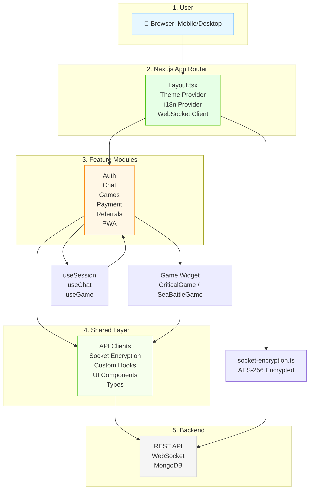

# Arcadeum Frontend Architecture

## Overview

The Arcadeum web frontend is a **Next.js 14+** application built with **App Router**, **React Server Components**, and **TypeScript**, designed for high performance, real-time multiplayer gaming, and seamless cross-platform experience. It communicates with the NestJS backend via WebSocket and REST APIs, and is optimized for SEO, PWA support, and accessibility.

This architecture follows **modular, feature-driven organization** with clear separation between UI components, business logic, state management, and API layers — making it scalable, testable, and maintainable.

---

## Core Architecture Principles

| Principle                    | Description                                                                                               |
| ---------------------------- | --------------------------------------------------------------------------------------------------------- |
| **App Router (Next.js 14+)** | Uses modern React Server Components (RSC) and Client Components strategically for performance and SEO     |
| **Feature-First Structure**  | Each feature (auth, chat, games) lives in its own folder with all related files grouped together          |
| **State Management**         | Uses React Context + custom hooks for local state; Redux Toolkit only where needed (e.g., global session) |
| **Type Safety**              | Full TypeScript coverage with interfaces, Zod validation, and generated types from backend DTOs           |
| **Real-Time Communication**  | WebSocket connection managed centrally via `socket-encryption.ts` for secure, encrypted game events       |
| **i18n & Localization**      | Type-safe translations using `next-intl` with hierarchical keys and fallbacks                             |
| **PWA & Offline Support**    | Service worker, manifest, and idle detection for offline play and reconnect                               |
| **Accessibility First**      | Semantic HTML, ARIA labels, keyboard navigation, and contrast compliance (WCAG 2.1)                       |
| **Testing Strategy**         | Playwright for E2E, Vitest for unit, and Storybook for component isolation                                |

---

## Layered Architecture

```
┌─────────────────────────────────────────────────┐
│                  Client (Browser)               │
└───────────────┬─────────────────────────────────┘
                │
┌───────────────▼─────────────────────────────────┐
│              Next.js App Router (Layouts)       │
│   - Root layout.tsx                             │
│   - Global error handling                       │
│   - Theme provider (CSS-in-JS)                  │
│   - i18n provider                               │
│   - WebSocket client initialization             │
└───────────────┬─────────────────────────────────┘
                │
┌───────────────▼─────────────────────────────────┐
│              Feature Modules (src/features)     │
│   - auth/          → Login, OAuth, Session      │
│   - chat/          → Real-time messaging        │
│   - games/         → Game engine UI (Critical,  │
│                    Sea Battle, Texas Hold’em)   │
│   - history/       → Game history viewer        │
│   - payment/       → Stripe/Payment flow        │
│   - referrals/     → Referral dashboard         │
│   - pwa/           → Offline, install prompts   │
│   - rematch/       → Game rematch logic         │
│   - support/       → Help center, contact       │
└───────────────┬─────────────────────────────────┘
                │
┌───────────────▼─────────────────────────────────┐
│           Shared Layer (src/shared)             │
│   - api/           → Client-side API clients    │
│   - lib/           → Utilities, socket-encryption │
│   - hooks/         → Custom React hooks         │
│   - types/         → Shared TypeScript interfaces │
│   - ui/            → Reusable components (Buttons, │
│                    Modals, Cards, etc.)         │
│   - config/        → API endpoints, env vars    │
│   - i18n/          → Translation keys & loader  │
└───────────────┬─────────────────────────────────┘
                │
┌───────────────▼─────────────────────────────────┐
│            UI Widgets (src/widgets)             │
│   - CriticalGame/          → Game UI component  │
│   - SeaBattleGame/         → Game UI component  │
│   - TexasHoldemGame/       → Game UI component  │
│   - GamesControlPanel/     → Game controls      │
│   - header/                → App header         │
└───────────────┬─────────────────────────────────┘
                │
┌───────────────▼─────────────────────────────────┐
│               Entities (src/entities)           │
│   - session/         → User session state       │
│   - support/         → Support ticket schema    │
└───────────────┬─────────────────────────────────┘
                │
┌───────────────▼─────────────────────────────────┐
│             Data Layer (Backend API)            │
│   - REST: /api/auth, /api/games, /api/payments  │
│   - WebSocket: wss://api.arcadeum.com/ws        │
│   - Encrypted via socket-encryption.ts          │
└─────────────────────────────────────────────────┘
```

---

## Key Modules Explained

### 1. **Authentication (`src/features/auth`, `src/shared/api/auth`)**

- Uses **OAuth2 (Google)** and **JWT** for login
- Session state managed via `useSession()` hook
- Redirects handled via `app/auth/` route with protected layouts
- Token stored securely in `localStorage` (encrypted)

### 2. **Real-Time Chat (`src/features/chat`, `src/shared/lib/socket-encryption.ts`)**

- WebSocket connection established on app load
- Messages encrypted using AES-256 (shared key from auth token)
- Messages dispatched via `useChat()` hook
- UI rendered in `ChatSidebar` widget

### 3. **Games (`src/features/games`, `src/widgets/CriticalGame`, etc.)**

- Each game has its own **UI widget** (`CriticalGame`, `SeaBattleGame`)
- Game state managed by **React state + WebSocket events**
- Game logic **client-side only** for responsiveness (server validates)
- Uses `useGame()` hook to subscribe to game events
- Supports **single-player vs bot** and **multiplayer**

### 4. **Payment Flow (`src/features/payment`, `src/shared/api/payment`)**

- Integrates with **Stripe** for subscriptions and credits
- Uses Stripe Elements for secure form input
- Payment confirmation handled via webhook → backend → WebSocket → UI update

### 5. **Referrals (`src/features/referrals`)**

- Displays referral code, stats, and badge rewards
- Fetches data from `/api/referrals`
- Uses `useReferrals()` hook for real-time updates

### 6. **PWA & Offline (`src/features/pwa`, `public/manifest.json`)**

- Service worker caches static assets and game state
- Detects offline status → shows “Reconnecting...” UI
- Allows “Add to Home Screen” prompt

### 7. **Internationalization (`src/shared/i18n`, `next-intl`)**

- Uses **type-safe translation keys** (e.g., `common.login`)
- Translations loaded per locale (`en`, `es`, `ru`, etc.)
- Automatic fallback to `en`
- Keys validated at build time via `check_translation.js` script

---

## Data Flow



> 💡 **Tip**: The `socket-encryption.ts` file ensures all WebSocket messages (game moves, chat, etc.) are encrypted using a key derived from the user’s JWT token — preventing man-in-the-middle attacks.

---

## Tooling & Development

| Tool                  | Purpose                                                    |
| --------------------- | ---------------------------------------------------------- |
| **Next.js 14**        | App Router, Server Components, Static/SSR                  |
| **TypeScript**        | Full type safety across frontend and shared types          |
| **Vitest**            | Fast unit tests for hooks, utilities, and reducers         |
| **Playwright**        | End-to-end tests for critical flows (login, game, payment) |
| **Storybook**         | Component-driven development for UI widgets                |
| **Prettier + ESLint** | Code formatting and linting                                |
| **TurboRepo**         | Monorepo task orchestration (`pnpm dev`, `pnpm build`)     |
| **Zod**               | Runtime validation for API responses                       |
| **next-intl**         | Type-safe i18n with automatic key extraction               |

---

## Security Considerations

- **WebSocket Encryption**: All real-time data encrypted via `socket-encryption.ts`
- **CORS**: Only allows traffic from `https://arcadeum.vercel.app` and `http://localhost:3000`
- **Content Security Policy (CSP)**: Applied via `next.config.js` to prevent XSS
- **Input Sanitization**: All user inputs sanitized on client and server
- **Rate Limiting**: Implemented on backend, mirrored with client-side throttling

---

## Performance Optimizations

- **Code Splitting**: Next.js automatically splits routes and components
- **Image Optimization**: WebP format, next/image for lazy loading
- **Server Components**: Used for data-fetching and static content
- **Client Components**: Only for interactive UI (games, chat, forms)
- **Bundle Analysis**: Run `pnpm --filter web build --analyse` to inspect bundle size
- **Preloading**: Critical game assets preloaded on homepage

---

## Future Enhancements

- ✅ Migrate to **React Server Actions** for form submissions
- ✅ Add **WebGPU** support for advanced game rendering
- ✅ Implement **WebRTC** for peer-to-peer multiplayer
- ✅ Add **dark/light mode auto-detection** based on OS
- ✅ Integrate **Sentry** for frontend error tracking
- ✅ Add **analytics** via Plausible or Google Analytics 4

---

## Documentation References

- [Backend Architecture](../docs/BACKEND_ARCHITECTURE.md)
- [Translation Type Safety](../docs/TRANSLATION_TYPE_SAFETY.md)
- [Playwright E2E Tests](apps/web/README.md#testing-strategy)
