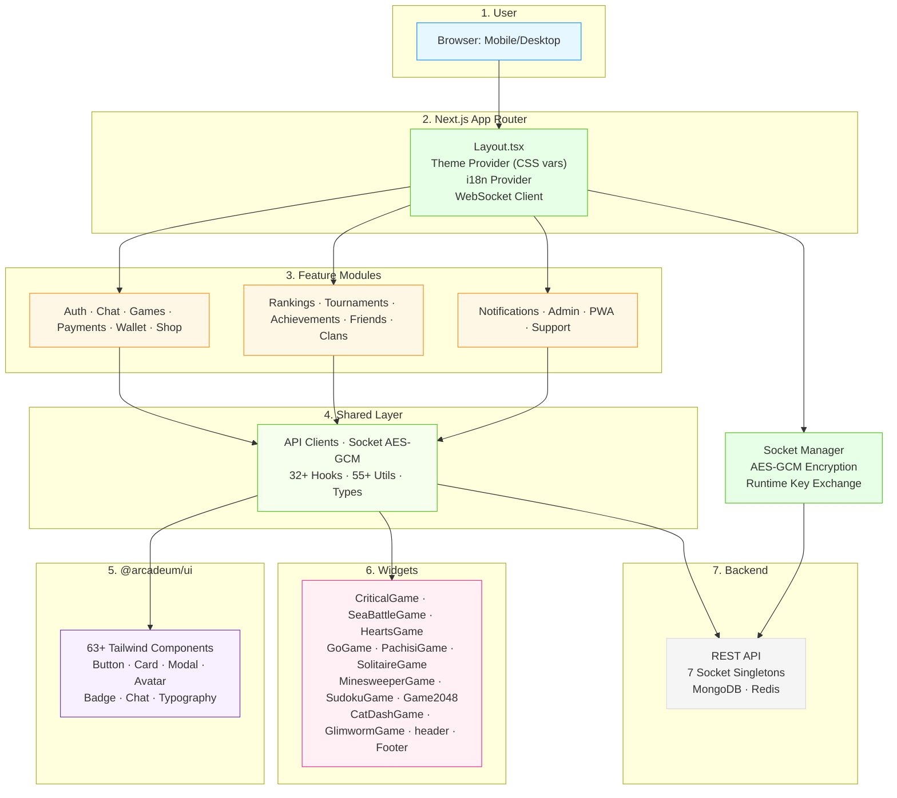

# Arcadeum Games Frontend Architecture

## Overview

The Arcadeum Games web frontend is a **Next.js 16+** application built with **App Router**, **React Server Components**, and **TypeScript**, designed for high performance, real-time multiplayer gaming, and seamless cross-platform experience. It communicates with the NestJS backend via WebSocket and REST APIs, and is optimized for SEO, PWA support, and accessibility.

This architecture follows **modular, feature-driven organization** with clear separation between UI components, business logic, state management, and API layers — making it scalable, testable, and maintainable.

---

## Core Architecture Principles

| Principle                    | Description                                                                                               |
| ---------------------------- | --------------------------------------------------------------------------------------------------------- |
| **App Router (Next.js 16+)** | Uses modern React Server Components (RSC) and Client Components strategically for performance and SEO     |
| **Feature-First Structure**  | Each feature (auth, chat, games) lives in its own folder with all related files grouped together          |
| **State Management**         | Uses Zustand for global client state, React Context for scoped state, React Query for server state        |
| **Type Safety**              | Full TypeScript coverage with interfaces and generated types from backend DTOs                            |
| **Real-Time Communication**  | WebSocket connection managed centrally via `shared/lib/socket` with AES-GCM encryption                   |
| **i18n & Localization**      | Type-safe translations using custom i18n system with hierarchical keys and fallbacks                      |
| **PWA & Offline Support**    | Service worker, manifest, and idle detection for offline play and reconnect                               |
| **Accessibility First**      | Semantic HTML, ARIA labels, keyboard navigation, and contrast compliance (WCAG 2.1)                       |
| **Testing Strategy**         | Playwright for E2E, Vitest for unit, and Storybook for component isolation                                |

---

## Layered Architecture

```
┌─────────────────────────────────────────────────┐
│                  Client (Browser)               │
└───────────────┬─────────────────────────────────┘
                │
┌───────────────▼─────────────────────────────────┐
│              Next.js App Router (Layouts)       │
│   - Root layout.tsx                             │
│   - Global error handling                       │
│   - Theme provider (CSS variables)              │
│   - i18n provider                               │
│   - WebSocket client initialization             │
└───────────────┬─────────────────────────────────┘
                │
┌───────────────▼─────────────────────────────────┐
│              Feature Modules (src/features)     │
│   - auth/          → Login, OAuth, Session      │
│   - chat/          → Real-time messaging        │
│   - games/         → Game engine UI (Critical,  │
│                    Sea Battle, Hearts, etc.)    │
│   - history/       → Game history viewer        │
│   - payments/      → Payment processing         │
│   - referrals/     → Referral dashboard         │
│   - pwa/           → Offline, install prompts   │
│   - shop/          → In-game shop               │
│   - wallet/        → Virtual wallet             │
│   - rankings/      → Player rankings            │
│   - tournaments/   → Tournament system          │
│   - achievements/  → Achievement tracking       │
│   - friends/       → Friend list & online status│
│   - clans/         → Clan/guild system          │
│   - notifications/ → Push & in-app notifications│
│   - admin/         → Admin panel                │
│   - support/       → Help center, contact       │
└───────────────┬─────────────────────────────────┘
                │
┌───────────────▼─────────────────────────────────┐
│           Shared Layer (src/shared)             │
│   - api/           → Client-side API clients    │
│   - lib/           → Utilities, socket, auth    │
│   - hooks/         → 32+ custom React hooks     │
│   - types/         → Shared TypeScript interfaces│
│   - config/        → Routes, themes, env vars   │
│   - i18n/          → Translation keys & loader  │
└───────────────┬─────────────────────────────────┘
                │
┌───────────────▼─────────────────────────────────┐
│     Shared UI Library (@arcadeum/ui)            │
│   - Button, Card, Modal, Input, TextArea        │
│   - Avatar, PlayerAvatar, Badge, StatusBadge    │
│   - LoadingState, ErrorState, EmptyState        │
│   - Chat, Toggle, Typography, Progress          │
│   - 63+ Tailwind CSS components                 │
└───────────────┬─────────────────────────────────┘
                │
┌───────────────▼─────────────────────────────────┐
│            UI Widgets (src/widgets)             │
│   - CriticalGame/          → Game UI component  │
│   - SeaBattleGame/         → Game UI component  │
│   - HeartsGame/            → Game UI component  │
│   - GoGame/                → Game UI component  │
│   - PachisiGame/           → Game UI component  │
│   - SpadesGame/            → Game UI component  │
│   - CascadeGame/           → Game UI component  │
│   - SolitaireGame/         → Game UI component  │
│   - MinesweeperGame/       → Game UI component  │
│   - SudokuGame/            → Game UI component  │
│   - Game2048/              → Game UI component  │
│   - CatDashGame/           → Game UI component  │
│   - GlimwormGame/          → Game UI component  │
│   - header/                → App header         │
│   - Footer/                → App footer         │
└───────────────┬─────────────────────────────────┘
                │
┌───────────────▼─────────────────────────────────┐
│               Entities (src/entities)           │
│   - session/         → User session state       │
│   - support/         → Support ticket schema    │
│   - leaderboard/     → Leaderboard data         │
└───────────────┬─────────────────────────────────┘
                │
┌───────────────▼─────────────────────────────────┐
│             Data Layer (Backend API)            │
│   - REST: /api/auth, /api/games, /api/payments  │
│   - WebSocket: 7 named socket singletons        │
│   - Encrypted via AES-GCM (runtime key exchange)│
└─────────────────────────────────────────────────┘
```

---

## Key Modules Explained

### 1. **Authentication (`src/features/auth`, `src/shared/api/auth`)**

- Uses **OAuth2 (Google)** and **JWT** for login
- Session state managed via Zustand store with localStorage persistence
- Anonymous user support with `anon_*` IDs for unauthenticated browsing
- Token stored securely in localStorage + cookie for SSR

### 2. **Real-Time Chat (`src/features/chat`, `src/shared/lib/socket`)**

- WebSocket connection established on app load via shared socket infrastructure
- 7 named socket singletons: games, chat, leaderboards, friends, wallet, clans, notifications
- All sockets use a shared Manager with multiplexing
- Auto-reconnect with exponential backoff
- Messages encrypted using AES-GCM (keys fetched at runtime from server)

### 3. **Games (`src/features/games`, `src/widgets/*Game`)**

- Each game has its own **UI widget** (CriticalGame, SeaBattleGame, HeartsGame, etc.)
- Game state managed by **React state + WebSocket events**
- Game logic **client-side only** for responsiveness (server validates)
- Uses `useGame()` hook to subscribe to game events
- Lazy-loaded via **game registry pattern** (`gameLoaders`)
- Supports **single-player vs bot** and **multiplayer**
- 18+ games across board, card, action, and puzzle categories

### 4. **Payment Flow (`src/features/payments`)**

- Integrates with payment processors for subscriptions and credits
- Payment confirmation handled via webhook → backend → WebSocket → UI update

### 5. **Referrals (`src/features/referrals`)**

- Displays referral code, stats, and badge rewards
- Real-time updates via socket

### 6. **PWA & Offline (`src/features/pwa`, `public/manifest.json`)**

- Service worker caches static assets and game state
- Detects offline status → shows "Reconnecting..." UI
- Allows "Add to Home Screen" prompt
- Custom push notification worker

### 7. **Internationalization (`src/shared/i18n`)**

- Uses **type-safe translation keys** via custom i18n system
- **5 locales**: en, ru, es, fr, by (Belarusian)
- Server-side: `getTranslations(locale)` loads full bundle
- Client-side: `useTranslation()` hook
- SEO slugs translated per locale (e.g., `/fr/jeux` instead of `/fr/games`)
- Automatic fallback to `en`
- Completeness test: `vitest run src/shared/i18n/messages/completeness.test.ts`

### 8. **Theme System (`src/shared/config/theme`, `packages/ui/src/themeDefinitions`)**

- **8 CSS-variable themes**: light, dark, neonLight, neonDark, violetLight, violetDark, tealLight, tealDark
- Tokens minted on `<html>` by theme provider from `packages/ui/src/themeDefinitions.ts`
- Use `var(--primary)`, `var(--glassBg)`, `bg-[var(--success)]`, etc.
- **Game visual themes** separate from app themes (cyberpunk, underwater, zen, etc.)
- Theme Adapter Pattern maps shared themes to game-specific tokens

---

## Data Flow

```
User → Browser → Next.js App Router → Feature Modules → Shared Layer → Backend API
                         │                                       │
                         ├── Theme Provider (CSS vars)            │
                         ├── i18n Provider                       │
                         └── WebSocket Client ←→ AES-GCM ←→ Socket Server
```

---

## Tooling & Development

| Tool                  | Purpose                                                    |
| --------------------- | ---------------------------------------------------------- |
| **Next.js 16**        | App Router, Server Components, Static/SSR, React Compiler  |
| **React 19**          | Server Components, concurrent features                     |
| **TypeScript 5.9**    | Full type safety across frontend and shared types          |
| **Vitest 4**          | Fast unit tests for hooks, utilities, and reducers         |
| **Playwright**        | End-to-end tests for critical flows (login, game, payment) |
| **Storybook 10**      | Component-driven development for UI widgets                |
| **Prettier + ESLint** | Code formatting and linting                                |
| **TurboRepo**         | Monorepo task orchestration (`pnpm dev`, `pnpm build`)     |
| **PostHog**           | Product analytics                                          |
| **Vercel Analytics**  | Performance and speed insights                             |

---

## Security Considerations

- **WebSocket Encryption**: All real-time data encrypted via AES-GCM with runtime key exchange
- **CORS**: Configured for allowed origins
- **Content Security Policy (CSP)**: Strict policy applied via headers
- **Input Sanitization**: All user inputs sanitized on client and server
- **Rate Limiting**: Implemented on backend, 3 tiers (default, auth, strict)
- **Anonymous User Support**: `anon_*` IDs for unauthenticated browsing with optional auth
- **CSRF Protection**: Global CSRF guard on all routes
- **Helmet**: Security headers on backend responses

---

## Performance Optimizations

- **Code Splitting**: Next.js automatically splits routes and components
- **Image Optimization**: WebP format, next/image for lazy loading
- **Server Components**: Used for data-fetching and static content
- **Client Components**: Only for interactive UI (games, chat, forms)
- **Bundle Analysis**: Run `pnpm --filter web build --analyse` to inspect bundle size
- **Lazy Loading**: Games loaded via registry pattern on demand
- **React Compiler**: Enabled for automatic memoization
- **PWA Caching**: Service worker with Workbox for offline support

---

## Architecture Diagram


```mermaid
graph TD
    %% ====== LAYERS ======
    subgraph "1. User"
        A[Browser: Mobile/Desktop]
    end

    subgraph "2. Next.js App Router"
        B["Layout.tsx<br/>Theme Provider (CSS vars)<br/>i18n Provider<br/>WebSocket Client"]
    end

    subgraph "3. Feature Modules"
        C[Auth · Chat · Games · Payments · Wallet · Shop]
        D[Rankings · Tournaments · Achievements · Friends · Clans]
        E[Notifications · Admin · PWA · Support]
    end

    subgraph "4. Shared Layer"
        F[API Clients · Socket AES-GCM<br/>32+ Hooks · 55+ Utils · Types]
    end

    subgraph "5. @arcadeum/ui"
        G[63+ Tailwind Components<br/>Button · Card · Modal · Avatar<br/>Badge · Chat · Typography]
    end

    subgraph "6. Widgets"
        H[CriticalGame · SeaBattleGame · HeartsGame<br/>GoGame · PachisiGame · SolitaireGame<br/>MinesweeperGame · SudokuGame · Game2048<br/>CatDashGame · GlimwormGame · header · Footer]
    end

    subgraph "7. Backend"
        I[REST API<br/>7 Socket Singletons<br/>MongoDB · Redis]
    end

    %% ====== FLOWS ======
    A --> B
    B --> C
    B --> D
    B --> E
    C --> F
    D --> F
    E --> F
    F --> G
    F --> H
    F --> I

    %% === Socket Flow ===
    B --> J["Socket Manager<br/>AES-GCM Encryption<br/>Runtime Key Exchange"]
    J --> I

    %% ====== STYLING ======
    style A fill:#e6f7ff,stroke:#1890ff
    style B fill:#e6ffe6,stroke:#52c41a
    style C fill:#fff7e6,stroke:#fa8c16
    style D fill:#fff7e6,stroke:#fa8c16
    style E fill:#fff7e6,stroke:#fa8c16
    style F fill:#f6ffed,stroke:#52c41a
    style G fill:#f9f0ff,stroke:#722ed1
    style H fill:#fff0f6,stroke:#eb2f96
    style I fill:#f5f5f5,stroke:#d9d9d9
    style J fill:#e6ffe6,stroke:#52c41a

    classDef layer fill:#f9f9f9,stroke:#ccc,stroke-width:1px;
    class B,C,D,E,F,G,H layer
```

> Render this diagram in any Markdown viewer that supports Mermaid (GitHub, VS Code with Mermaid plugin, or [Mermaid Live Editor](https://mermaid.live)).

---

## Documentation References

- [Backend Architecture](../docs/BACKEND_ARCHITECTURE.md)
- [Socket Architecture](../docs/SOCKET_ARCHITECTURE.md)
- [Translation Type Safety](../docs/TRANSLATION_TYPE_SAFETY.md)
- [Games Feature Architecture](../apps/web/src/features/games/README.md)
