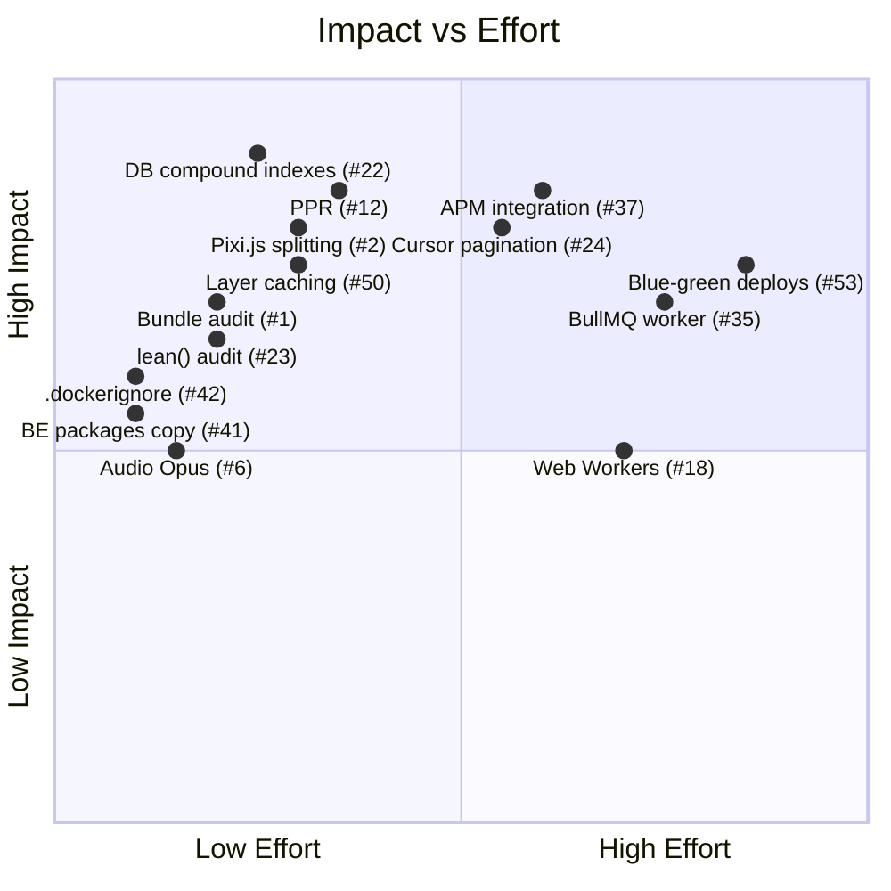

# Performance Optimisations — Arcadeum

Covers Frontend (Next.js 16 + React 19), Backend (NestJS + MongoDB + Redis), and OCI / Container Infrastructure.

---

## 1 · Frontend (Next.js Web App)

### 1.1 Bundle Size & Code Splitting

| #   | Action                                                                                                                                                                                                           | Why                                                                                     |
| --- | ---------------------------------------------------------------------------------------------------------------------------------------------------------------------------------------------------------------- | --------------------------------------------------------------------------------------- |
| 1   | Run `ANALYZE=true pnpm --filter web build` and audit the treemap. Identify any library duplicated across chunks (e.g. `recharts`, `pixi.js`)                                                                     | Currently 40+ `dynamic()` imports exist, but heavy libs may still land in shared chunks |
| 2   | Move `pixi.js` + `pixi-filters` behind route-level dynamic imports for game widgets that actually use them (Cat Dash, 2048 canvas mode). Gate with `ssr: false`                                                  | PixiJS is ~300 kB min+gzip — users on non-Canvas games pay the cost today               |
| 3   | Replace `recharts` full import with `import { LineChart } from 'recharts/es6/chart/LineChart'` or switch to a lighter alternative (`lightweight-charts`, custom `<canvas>`) for stats pages                      | recharts tree-shakes poorly; even with `optimizePackageImports` a lot leaks             |
| 4   | Audit `socket.io-client` — if only WebSocket transport is used, configure `transports: ['websocket']` and drop the HTTP long-polling fallback code path                                                          | Removes ~18 kB of unused polling engine from client bundle                              |
| 5   | Confirm React Compiler (`babel-plugin-react-compiler`) is actually running in prod builds (check `.next/trace` output). If active, remove manual `useMemo`/`useCallback` wrappers that the compiler auto-injects | Eliminates developer overhead + dead code from manual memoisation                       |

### 1.2 Image & Media Optimisation

| #   | Action                                                                                                                                                                                                                                                        | Why                                                                                           |
| --- | ------------------------------------------------------------------------------------------------------------------------------------------------------------------------------------------------------------------------------------------------------------- | --------------------------------------------------------------------------------------------- |
| 6   | Convert the remaining `clockwork-horizon.mp3` (6.2 MB) to Opus/WebM at 96 kbps → ~1.5 MB. Lazy-load with `<audio preload="none">`                                                                                                                             | Largest single asset in `/public`. Currently blocks FCP on slow connections if eagerly loaded |
| 7   | Generate AVIF variants for all shop avatar PNGs (`/shop/avatars/*.png`, many > 100 kB). Use `<Image>` from Next.js with `formats: ['image/avif', 'image/webp']` (already configured) but ensure each avatar goes through `next/image` rather than raw `` | AVIF saves 40–60% over PNG for photo-like content                                             |
| 8   | Consider consolidating avatar spritesheets (`avatars_spritesheet.png`, `badges_spritesheet.png`) into a single WebP atlas with CSS background-position rendering                                                                                              | Fewer HTTP requests, better cache utilisation                                                 |
| 9   | Audit every game background image — ensure the hero/cover images use `priority` prop on LCP candidates and `loading="lazy"` on below-the-fold images                                                                                                          | Directly impacts LCP metric                                                                   |
| 10  | Move large static media (music, spritesheets, game backgrounds) to the R2 CDN (`NEXT_PUBLIC_CDN_URL`) if not already there, with immutable `Cache-Control`                                                                                                    | Offloads bandwidth from the application container, enables edge caching                       |

### 1.3 Rendering & Core Web Vitals

| #   | Action                                                                                                                                                                                                                                 | Why                                                                                                |
| --- | -------------------------------------------------------------------------------------------------------------------------------------------------------------------------------------------------------------------------------------- | -------------------------------------------------------------------------------------------------- |
| 11  | Audit `'use client'` boundaries — currently ~40+ `*Client.tsx` files. Each creates a client component boundary. Verify that data-fetching happens in the parent Server Component, not inside the client boundary                       | Reduces hydration payload; follows AGENTS.md rule                                                  |
| 12  | Enable Next.js Partial Prerendering (PPR) for semi-static pages (landing, blog, terms, notes) by adding `experimental.ppr = true` to [next.config.ts](file:///Users/anatoliyaliaksandrau/js/arcadeum_claude_2/apps/web/next.config.ts) | Static shell serves instantly; dynamic slots stream in. Massive TTFB improvement for content pages |
| 13  | Replace the `stale-while-revalidate=59` header on dynamic pages with ISR revalidation (`revalidate: 60` in page-level `fetch`) so the CDN/edge can serve stale content for most requests                                               | Current setup revalidates on every single request; ISR shifts this to background                   |
| 14  | Add `fetchPriority="high"` to the above-the-fold hero image on the landing page                                                                                                                                                        | Signals the browser to prioritise the LCP image in the resource queue                              |
| 15  | Implement `@next/third-parties` for Vercel Analytics + PostHog to defer their initialisation until after hydration                                                                                                                     | Reduces TBT (Total Blocking Time) on mobile                                                        |

### 1.4 Runtime Performance

| #   | Action                                                                                                                                                                                              | Why                                                                  |
| --- | --------------------------------------------------------------------------------------------------------------------------------------------------------------------------------------------------- | -------------------------------------------------------------------- |
| 16  | Profile WebSocket reconnection storms — when the tab regains focus, `socket.io-client` may reconnect + re-subscribe to all rooms simultaneously. Implement exponential backoff + connection pooling | Prevents CPU spikes and jank after device sleep                      |
| 17  | Audit Zustand store subscriptions in game widgets — if the entire store is re-read on every game tick (e.g. Chess move list, Sea Battle board), add selectors to avoid unnecessary re-renders       | Game UIs are the most performance-sensitive surfaces                 |
| 18  | Move heavy game computations (Sudoku solver validation, Minesweeper flood-fill) to a Web Worker via `Comlink`                                                                                       | Unblocks the main thread during computationally expensive operations |
| 19  | Debounce/throttle resize and scroll event listeners in game board components — check `ChessBoard.tsx`, `CascadeBoard.tsx`, `MinesweeperBoard.tsx` for direct `addEventListener` usage               | Reduces layout thrashing on mobile                                   |

### 1.5 Service Worker & PWA

| #   | Action                                                                                                                                            | Why                                                                                       |
| --- | ------------------------------------------------------------------------------------------------------------------------------------------------- | ----------------------------------------------------------------------------------------- |
| 20  | Add a versioned precache manifest for critical game assets (board sprites, card sprites) so the SW pre-caches them on install, not on first use   | Eliminates visible loading spinners when entering a game for the first time after install |
| 21  | Implement stale-while-revalidate for API responses to `/api/games/*` and `/api/leaderboards/*` so offline-first users see cached data immediately | Better perceived performance, especially on flaky mobile connections                      |

---

## 2 · Backend (NestJS + MongoDB + Redis)

### 2.1 Database (MongoDB) Optimisation

| #   | Action                                                                                                                                                                                                                                                                        | Why                                                                                                                                                                           |
| --- | ----------------------------------------------------------------------------------------------------------------------------------------------------------------------------------------------------------------------------------------------------------------------------- | ----------------------------------------------------------------------------------------------------------------------------------------------------------------------------- |
| 22  | Run `db.collection.getIndexes()` on all 40+ schemas and compare against actual query patterns (`explain('executionStats')`). Identify missing compound indexes, especially on `game-room` (status + gameType + createdAt) and `game-history` (userId + gameType + finishedAt) | Schemas define indexes but compound indexes for multi-field queries may be missing. Full collection scans on history queries are the #1 latency source in most game platforms |
| 23  | Add `lean()` to all read-only queries that don't need Mongoose document features. Currently ~50+ services use `.lean()` but several (auth, chat, tournaments) may still return full documents                                                                                 | `lean()` skips hydration overhead — 2–5× faster for large result sets                                                                                                         |
| 24  | Implement cursor-based pagination (using `_id` or `createdAt`) for game history, chat messages, and notifications instead of `skip/limit`                                                                                                                                     | `skip(N)` scans and discards N documents. At scale (>100k games per user), this becomes O(N)                                                                                  |
| 25  | Add `select()` projections to queries that only need a subset of fields (e.g. game room listings only need `id`, `gameType`, `status`, `players.username`, `createdAt`)                                                                                                       | Reduces BSON deserialization cost + network transfer between Mongo and Node                                                                                                   |
| 26  | Create TTL indexes on ephemeral collections: `password-reset-tokens` (24h), `refresh-tokens` (30d), `push-subscriptions` (90d)                                                                                                                                                | Let MongoDB auto-expire stale records instead of running cleanup crons                                                                                                        |
| 27  | For leaderboard aggregation queries, consider Materialized Views (`$merge` into a pre-aggregated collection) refreshed by a background cron rather than real-time aggregation on every request                                                                                | Current `@CacheInterceptor` on leaderboards hides the problem; if cache misses occur under load the aggregation pipeline blocks for 500ms+                                    |

### 2.2 Redis / Caching

| #   | Action                                                                                                                                                                                                                                                                      | Why                                                                                      |
| --- | --------------------------------------------------------------------------------------------------------------------------------------------------------------------------------------------------------------------------------------------------------------------------- | ---------------------------------------------------------------------------------------- |
| 28  | Audit `@CacheInterceptor` TTLs — controllers like `GamesController`, `LeaderboardsController`, `AchievementsController`, `ClansController` use cache but may have default 60s TTL. Tune per-route: leaderboards can tolerate 5 min, active game rooms need < 5s or no cache | One-size-fits-all TTL wastes memory or serves stale data                                 |
| 29  | Implement cache warming on deployment: pre-populate leaderboard, season, and achievement definition caches during `onModuleInit()`                                                                                                                                          | Eliminates the "cold start" cache-miss thundering herd after every deploy                |
| 30  | For real-time game state, switch from Redis key-value to Redis Streams or Pub/Sub with `@socket.io/redis-adapter` already in place — but verify the adapter is using `msgpack` serialisation instead of JSON                                                                | msgpack is 30–40% smaller and faster to parse for binary-heavy game state payloads       |
| 31  | Add per-user rate-limit keys in Redis for WebSocket events (move submissions, chat messages) to prevent abuse without blocking the event loop                                                                                                                               | Current `@Throttle` decorators cover HTTP; WebSocket gateway likely has no rate limiting |

### 2.3 Application Layer

| #   | Action                                                                                                                                                                                                                                                                                     | Why                                                                                   |
| --- | ------------------------------------------------------------------------------------------------------------------------------------------------------------------------------------------------------------------------------------------------------------------------------------------ | ------------------------------------------------------------------------------------- |
| 32  | Enable `compression()` middleware (already imported in [main.ts](file:///Users/anatoliyaliaksandrau/js/arcadeum_claude_2/apps/be/src/main.ts#L54)) but check if `CompressedIoAdapter` also compresses WebSocket frames — if not, enable `perMessageDeflate` on the Socket.IO server config | HTTP is compressed, WS may not be — game state diffs can be 2–10 kB per tick          |
| 33  | Replace synchronous bcrypt operations with async `bcrypt.hash()`/`bcrypt.compare()` if any sync variants are used in auth flows                                                                                                                                                            | Sync bcrypt blocks the event loop for 50–200ms per operation                          |
| 34  | Implement connection pooling for MongoDB: set `maxPoolSize` in Mongoose connection options (default is 100, which may be too high for a single container or too low for multiple)                                                                                                          | Tune based on actual concurrent queries. Monitor with `db.serverStatus().connections` |
| 35  | Move BullMQ job processing (if computationally heavy like achievement calculation, leaderboard snapshots) to a dedicated worker container rather than running in the same process as the API                                                                                               | Prevents CPU-heavy background jobs from starving HTTP/WebSocket request handling      |
| 36  | Add response payload size limits and pagination enforcement on all list endpoints — `notifications`, `chat/messages`, `game-history` — to prevent accidental multi-MB responses                                                                                                            | Protects against OOM on the server and slow downloads on the client                   |

### 2.4 Observability

| #   | Action                                                                                                                                                              | Why                                                                                                                    |
| --- | ------------------------------------------------------------------------------------------------------------------------------------------------------------------- | ---------------------------------------------------------------------------------------------------------------------- |
| 37  | Integrate APM (e.g. Sentry Performance, Datadog APM, or OpenTelemetry with Jaeger) to trace request latency across MongoDB queries, Redis ops, and WebSocket events | Cannot optimise what you cannot measure. Current setup has basic logging (`ArcadeumLogger`) but no distributed tracing |
| 38  | Add MongoDB slow-query logging (`profile: 1`, `slowms: 100`) in staging/production and pipe results to a dashboard                                                  | Identifies regression queries before they impact users                                                                 |
| 39  | Monitor Redis memory usage and eviction rates via `INFO` command. Set `maxmemory-policy allkeys-lru` if not already configured                                      | Prevents Redis OOM crashes under sustained cache pressure                                                              |

---

## 3 · OCI / Container Infrastructure

### 3.1 Image Size Reduction

| #   | Action                                                                                                                                                                                                                                                       | Why                                                                                                                                                               |
| --- | ------------------------------------------------------------------------------------------------------------------------------------------------------------------------------------------------------------------------------------------------------------ | ----------------------------------------------------------------------------------------------------------------------------------------------------------------- |
| 40  | Web Dockerfile: switch from `node:22-alpine` to `node:22-alpine3.20` (or the latest point release) pinned for reproducibility. Add `--ignore-scripts` to `pnpm install` in the deps stage to skip native addon compilation where not needed                  | Reduces attack surface + speeds up CI builds                                                                                                                      |
| 41  | BE Dockerfile: the `COPY packages/ packages/` line copies the entire `packages/ui` directory (UI components, Storybook stories, etc.) into the BE builder — only `packages/games-core` is needed. Change to `COPY packages/games-core/ packages/games-core/` | Current BE image includes ~all of `@arcadeum/ui` (thousands of component files). Shaving this alone may cut 50–100 MB off the builder layer                       |
| 42  | Add a `.dockerignore` to the monorepo root excluding `apps/mobile`, `apps/tg-bot`, `.git`, `node_modules`, `*.md`, `docs/`, `scripts/shorts-factory/`, `.storybook/`, `e2e/`, `*.spec.ts`, `*.test.ts`                                                       | `COPY . .` in the builder stage currently sends the entire monorepo as Docker context. A proper `.dockerignore` can reduce context transfer from ~1 GB to <200 MB |
| 43  | Use multi-stage builds with explicit `--mount=type=cache,target=/root/.local/share/pnpm/store` for the pnpm store to persist across builds                                                                                                                   | Speeds up `pnpm install` in CI from ~90s to ~10s on cache hit                                                                                                     |
| 44  | Pin `dumb-init` version in BE Dockerfile (`apk add --no-cache dumb-init=1.2.5-r3`) for reproducibility                                                                                                                                                       | Avoids unexpected behaviour from silent upgrades                                                                                                                  |
| 45  | For the web runner stage, verify that standalone output doesn't include server-side source maps (config already has `productionBrowserSourceMaps: false`, but server maps may still exist at 591 MB standalone)                                              | Source maps for SSR can be 100+ MB. Remove them or upload to Sentry/error tracking and delete from the image                                                      |

### 3.2 Container Runtime

| #   | Action                                                                                                                                                                                  | Why                                                                                                                      |
| --- | --------------------------------------------------------------------------------------------------------------------------------------------------------------------------------------- | ------------------------------------------------------------------------------------------------------------------------ |
| 46  | Set explicit memory/CPU limits in `docker-compose.yml` (e.g. `deploy.resources.limits.memory: 1.5g` for BE, `2g` for web)                                                               | Prevents a single container from consuming all host resources; aligns with `--max-old-space-size=1536` already set on BE |
| 47  | Add `NODE_OPTIONS="--max-old-space-size=1024"` to the web runner stage. Next.js standalone server defaults to V8's heuristic (~1.7 GB on a 4 GB container), which can trigger OOM kills | Explicit limit prevents V8 from over-allocating                                                                          |
| 48  | Enable Node.js `--dns-result-order=ipv4first` on both containers if running in a dual-stack environment                                                                                 | Avoids 200–500ms DNS resolution delays when IPv6 lookups time out before falling back to IPv4                            |
| 49  | Add liveness + readiness probes in Kubernetes/Docker Compose. Current `healthcheck` hits `/health` every 30s. Add a separate readiness check that verifies MongoDB + Redis connectivity | Prevents traffic from reaching a container that booted but hasn't connected to its databases yet                         |

### 3.3 CI/CD & Build Pipeline

| #   | Action                                                                                                                                                                                                                                                    | Why                                                                                                    |
| --- | --------------------------------------------------------------------------------------------------------------------------------------------------------------------------------------------------------------------------------------------------------- | ------------------------------------------------------------------------------------------------------ |
| 50  | Implement Docker layer caching in CI (GitHub Actions `docker/build-push-action` with `cache-from: type=gha`). If not using GHA, use BuildKit inline cache or a registry-backed cache                                                                      | Monorepo builds are slow (~5–10 min). Layer caching cuts this to ~1–2 min for source-only changes      |
| 51  | Split the BE build into two CI jobs: `build + test` and `docker build + push`. The test job runs `jest --forceExit --runInBand` with `NODE_OPTIONS='--max-old-space-size=4096'` — this is expensive and shouldn't block image pushes on unrelated changes | Parallelise test and build for faster feedback                                                         |
| 52  | Add image scanning (Trivy, Snyk Container) to the CI pipeline to catch vulnerable base image packages                                                                                                                                                     | Alpine images are small but still have CVEs; automated scanning catches them before deployment         |
| 53  | Implement blue-green or canary deployments so new container versions are validated with real traffic (1–5%) before full rollout                                                                                                                           | Prevents bad deployments from immediately affecting all users — critical for a real-time game platform |

### 3.4 Networking & Reverse Proxy

| #   | Action                                                                                                                                                  | Why                                                                                                      |
| --- | ------------------------------------------------------------------------------------------------------------------------------------------------------- | -------------------------------------------------------------------------------------------------------- |
| 54  | If using nginx/Caddy as a reverse proxy in front of the containers, enable HTTP/2 (or HTTP/3 with QUIC) for multiplexed requests and header compression | Reduces latency for the many small parallel requests during game page loads (sprites, sounds, API calls) |
| 55  | Configure the proxy to set `Connection: keep-alive` with a 60s+ timeout between proxy and Node.js containers                                            | Prevents TCP handshake overhead on repeated API calls from the same client                               |
| 56  | Enable Brotli compression at the proxy level for static assets (JS, CSS, SVG, JSON). Next.js doesn't serve Brotli by default in standalone mode         | Brotli achieves 15–25% better compression ratio than gzip for text resources                             |

---

## Priority Matrix

### Recommended order

1. **Quick wins** (< 1 day each): #1, #6, #23, #41, #42, #44, #47
2. **High-impact medium effort** (1–3 days): #2, #12, #22, #24, #28, #50
3. **Strategic investments** (3–7 days): #18, #27, #35, #37, #53
