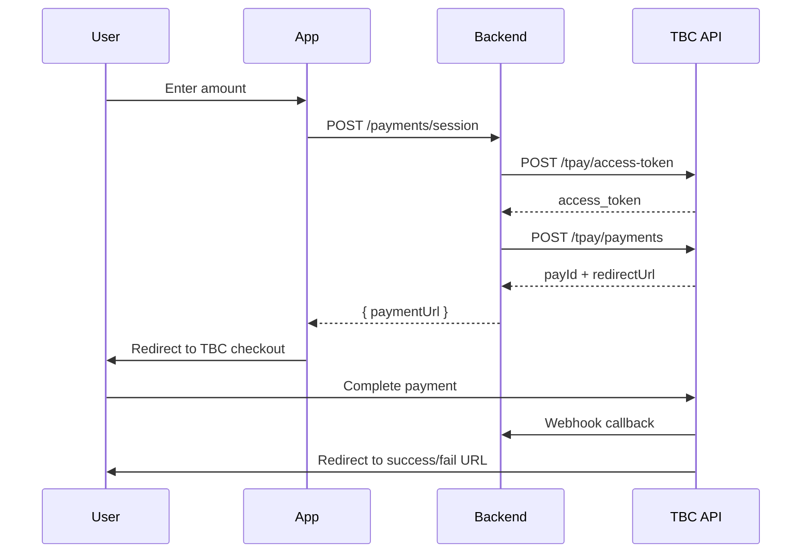

# TBC E-Commerce (Checkout) Integration Guide

Step-by-step guide to integrate TBC Bank's payment gateway for international Visa/Mastercard payments with payout to Georgian IBAN.

---

## Phase 1: Business Setup (1-2 weeks)

### Step 1: Open TBC Business Account
- Visit any TBC Bank branch with:
  - Company registration documents
  - Director's ID
  - Company stamp (if applicable)
- Request a **business current account** for receiving payments

### Step 2: Apply for E-Commerce Merchant Account
- Contact TBC Bank's merchant services:
  - 📞 Phone: **032 2 27 27 27**
  - 🌐 Portal: [ecom.tbcpayments.ge](https://ecom.tbcpayments.ge)
- Provide:
  - Business registration certificate
  - Website/app details
  - Expected transaction volumes
  - Business model description

> [!IMPORTANT]
> **Before applying**: Call and confirm they accept **gaming/entertainment apps**. Explain it's a card game platform (not gambling) to avoid rejection like with UniPAY.

### Step 3: Receive Merchant Credentials
After approval, TBC will send to your company email:
- `client_id` — Your merchant identifier
- `client_secret` — Your API secret key
- `apikey` — Developer portal API key

---

## Phase 2: Developer Portal Setup

### Step 4: Register on TBC Developers Portal
1. Go to [developers.tbcbank.ge](https://developers.tbcbank.ge)
2. Create a developer account
3. Register your application to get `apikey`

### Step 5: Configure Merchant Dashboard
1. Log in to [ecom.tbcpayments.ge](https://ecom.tbcpayments.ge)
2. Add your callback URLs:
   - **Success URL**: `https://yourdomain.com/payment/success`
   - **Fail URL**: `https://yourdomain.com/payment/fail`
   - **Callback URL**: `https://yourdomain.com/api/payments/webhook`

---

## Phase 3: Code Integration

### Step 6: Environment Variables

Add to your `.env` file:

```bash
# TBC E-Commerce Configuration
TBC_API_BASE_URL=https://api.tbcbank.ge
TBC_CLIENT_ID=your_client_id
TBC_CLIENT_SECRET=your_client_secret
TBC_API_KEY=your_api_key
TBC_DEFAULT_CURRENCY=GEL
TBC_SUCCESS_URL=https://yourdomain.com/payment/success
TBC_FAIL_URL=https://yourdomain.com/payment/fail
TBC_CALLBACK_URL=https://yourdomain.com/api/payments/webhook
```

### Step 7: API Integration Flow



### Step 8: API Endpoints Reference

| Action | Method | Endpoint |
|--------|--------|----------|
| Get Access Token | POST | `/v1/tpay/access-token` |
| Create Payment | POST | `/v1/tpay/payments` |
| Get Payment Status | GET | `/v1/tpay/payments/{payId}` |
| Cancel Payment | POST | `/v1/tpay/payments/{payId}/cancel` |
| Complete Pre-auth | POST | `/v1/tpay/payments/{payId}/completion` |

### Step 9: Authentication

**Get access token** (valid for 24 hours):

```typescript
// Request
POST https://api.tbcbank.ge/v1/tpay/access-token
Headers:
  apikey: YOUR_API_KEY
  Content-Type: application/x-www-form-urlencoded

Body:
  client_id=YOUR_CLIENT_ID
  client_secret=YOUR_CLIENT_SECRET

// Response
{
  "access_token": "eyJhbGciOiJSUzI1NiIs...",
  "expires_in": 86400,
  "token_type": "Bearer"
}
```

### Step 10: Create Payment

```typescript
// Request
POST https://api.tbcbank.ge/v1/tpay/payments
Headers:
  apikey: YOUR_API_KEY
  Authorization: Bearer ACCESS_TOKEN
  Content-Type: application/json

Body:
{
  "amount": {
    "currency": "GEL",
    "total": 10.00,
    "subTotal": 10.00,
    "tax": 0,
    "shipping": 0
  },
  "returnurl": "https://yourdomain.com/payment/success",
  "extra": "order_123",
  "expirationMinutes": 10,
  "callbackUrl": "https://yourdomain.com/api/payments/webhook",
  "preAuth": false,
  "language": "EN",
  "merchantPaymentId": "unique_order_id_123",
  "saveCard": false
}

// Response
{
  "payId": "abc123xyz",
  "status": "Created",
  "currency": "GEL",
  "amount": 10.00,
  "links": [
    {
      "uri": "https://ecommerce.tbcbank.ge/checkout/abc123xyz",
      "method": "REDIRECT",
      "rel": "approval_url"
    }
  ]
}
```

---

## Phase 4: Replace UniPAY in Your Backend

Your current `payments.service.ts` needs to be updated. The structure is similar:

| UniPAY | TBC E-Commerce |
|--------|----------------|
| `/v3/auth` | `/v1/tpay/access-token` |
| `/v3/order` | `/v1/tpay/payments` |
| `merchant_id` + `api_key` | `client_id` + `client_secret` + `apikey` |
| `OrderHashID` | `payId` |
| `PaymentPageUrl` | `links[].uri` where `rel="approval_url"` |

---

## Phase 5: Testing

### Step 11: Use Sandbox Environment
- TBC provides a sandbox at the developer portal
- Download Postman collection from [developers.tbcbank.ge](https://developers.tbcbank.ge)
- Test all flows before going live

### Step 12: Test Cards
Use TBC's test card numbers (provided in sandbox documentation) to simulate:
- Successful payments
- Failed payments
- 3D Secure flows

---

## Timeline Summary

| Phase | Duration | Status |
|-------|----------|--------|
| Business account setup | 1-3 days | ⬜ Not started |
| Merchant application | 3-7 days | ⬜ Not started |
| Developer portal setup | 1 day | ⬜ Not started |
| Code integration | 1-2 days | ⬜ Not started |
| Testing | 1-2 days | ⬜ Not started |

---

## Useful Links

- 📚 [TBC Developers Portal](https://developers.tbcbank.ge)
- 🛒 [TBC Merchant Dashboard](https://ecom.tbcpayments.ge)
- 📖 [API Documentation](https://developers.tbcbank.ge/reference/checkout-payments)
- 📞 TBC Support: **032 2 27 27 27**
