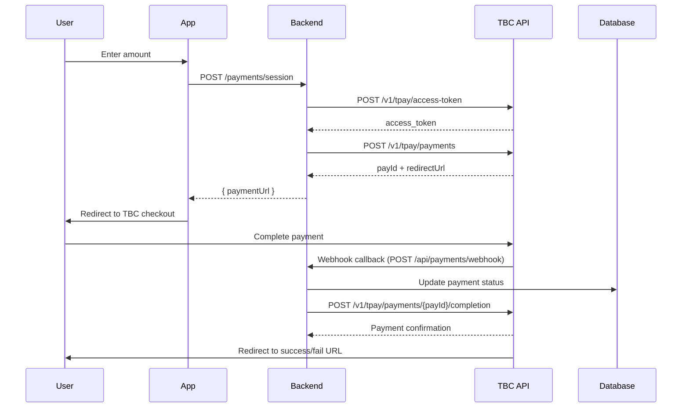

# TBC E-Commerce (Checkout) Integration Guide

Step-by-step guide to integrate TBC Bank's payment gateway for international Visa/Mastercard payments with payout to Georgian IBAN.

---

## Phase 1: Business Setup (1-2 weeks)

### Step 1: Open TBC Business Account

- Visit any TBC Bank branch with:
  - Company registration documents
  - Director's ID
  - Company stamp (if applicable)
- Request a **business current account** for receiving payments
- Ensure you have a registered business in Georgia
- Have your tax identification number ready

### Step 2: Apply for E-Commerce Merchant Account

- Contact TBC Bank's merchant services:
  - 📞 Phone: **032 2 27 27 27**
  - 🌐 Portal: [ecom.tbcpayments.ge](https://ecom.tbcpayments.ge)
- Provide:
  - Business registration certificate
  - Website/app details (include screenshots)
  - Expected transaction volumes (monthly estimates)
  - Business model description (emphasize it's a card game platform, not gambling)
  - Terms of service and privacy policy documents
  - Bank account details for payouts (Georgian IBAN)

> [!IMPORTANT] > **Before applying**: Call and confirm they accept **gaming/entertainment apps**. Explain it's a card game platform (not gambling) to avoid rejection like with UniPAY. Be prepared to provide additional documentation if requested.

### Step 3: Receive Merchant Credentials

After approval, TBC will send to your company email:

- `client_id` — Your merchant identifier
- `client_secret` — Your API secret key
- `apikey` — Developer portal API key
- `merchant_code` — Merchant code for payment processing
- `test_credentials` — Sandbox environment credentials

> 💡 **Tip**: Store credentials securely using environment variables. Never commit them to version control.

---

## Phase 2: Developer Portal Setup

### Step 4: Register on TBC Developers Portal

1. Go to [developers.tbcbank.ge](https://developers.tbcbank.ge)
2. Create a developer account with your business email
3. Register your application to get `apikey`
4. Download the Postman collection for API testing
5. Join the TBC developer community for updates

### Step 5: Configure Merchant Dashboard

1. Log in to [ecom.tbcpayments.ge](https://ecom.tbcpayments.ge)
2. Add your callback URLs:
   - **Success URL**: `https://yourdomain.com/payment/success`
   - **Fail URL**: `https://yourdomain.com/payment/fail`
   - **Callback URL**: `https://yourdomain.com/api/payments/webhook`
   - **Cancel URL**: `https://yourdomain.com/payment/cancel`
3. Configure notification settings:
   - Enable webhook notifications
   - Set notification format to JSON
   - Configure retry policies for failed webhooks
4. Set up payment methods:
   - Enable Visa and Mastercard
   - Configure currency (GEL)
   - Set transaction limits

> [!TIP]
> Use the same URLs for both sandbox and production environments during testing, then update to production URLs before going live.

---

## Phase 3: Code Integration

### Step 6: Environment Variables

Add to your `.env` file:

```bash
# TBC E-Commerce Configuration
TBC_API_BASE_URL=https://api.tbcbank.ge
TBC_CLIENT_ID=your_client_id
TBC_CLIENT_SECRET=your_client_secret
TBC_API_KEY=your_api_key
TBC_MERCHANT_CODE=your_merchant_code
TBC_DEFAULT_CURRENCY=GEL
TBC_SUCCESS_URL=https://yourdomain.com/payment/success
TBC_FAIL_URL=https://yourdomain.com/payment/fail
TBC_CANCEL_URL=https://yourdomain.com/payment/cancel
TBC_CALLBACK_URL=https://yourdomain.com/api/payments/webhook
TBC_ENVIRONMENT=production # or sandbox
```

### Step 7: API Integration Flow



### Step 8: API Endpoints Reference

| Action              | Method | Endpoint                               | Description                                 |
| ------------------- | ------ | -------------------------------------- | ------------------------------------------- |
| Get Access Token    | POST   | `/v1/tpay/access-token`                | Get OAuth2 access token for API calls       |
| Create Payment      | POST   | `/v1/tpay/payments`                    | Create payment request                      |
| Get Payment Status  | GET    | `/v1/tpay/payments/{payId}`            | Check payment status                        |
| Cancel Payment      | POST   | `/v1/tpay/payments/{payId}/cancel`     | Cancel payment before completion            |
| Complete Pre-auth   | POST   | `/v1/tpay/payments/{payId}/completion` | Complete pre-authorized payment             |
| Refund Payment      | POST   | `/v1/tpay/payments/{payId}/refund`     | Refund a completed payment                  |
| Get Payment History | GET    | `/v1/tpay/payments`                    | Get list of payments (pagination supported) |

### Step 9: Authentication

**Get access token** (valid for 24 hours):

```typescript
// Request
POST https://api.tbcbank.ge/v1/tpay/access-token
Headers:
  apikey: YOUR_API_KEY
  Content-Type: application/x-www-form-urlencoded

Body:
  client_id=YOUR_CLIENT_ID
  client_secret=YOUR_CLIENT_SECRET

// Response
{
  "access_token": "eyJhbGciOiJSUzI1NiIs...",
  "expires_in": 86400,
  "token_type": "Bearer"
}
```

**Token refresh strategy**:

- Store token and expiration time
- Check token expiration before each API call
- Refresh token automatically if expired
- Implement exponential backoff for failed refresh attempts

### Step 10: Create Payment

```typescript
// Request
POST https://api.tbcbank.ge/v1/tpay/payments
Headers:
  apikey: YOUR_API_KEY
  Authorization: Bearer ACCESS_TOKEN
  Content-Type: application/json

Body:
{
  "amount": {
    "currency": "GEL",
    "total": 10.00,
    "subTotal": 10.00,
    "tax": 0,
    "shipping": 0
  },
  "returnurl": "https://yourdomain.com/payment/success",
  "cancelurl": "https://yourdomain.com/payment/cancel",
  "extra": "order_123",
  "expirationMinutes": 10,
  "callbackUrl": "https://yourdomain.com/api/payments/webhook",
  "preAuth": false,
  "language": "EN",
  "merchantPaymentId": "unique_order_id_123",
  "saveCard": false,
  "customer": {
    "email": "user@example.com",
    "phone": "+995555123456",
    "name": "John Doe"
  }
}

// Response
{
  "payId": "abc123xyz",
  "status": "Created",
  "currency": "GEL",
  "amount": 10.00,
  "links": [
    {
      "uri": "https://ecommerce.tbcbank.ge/checkout/abc123xyz",
      "method": "REDIRECT",
      "rel": "approval_url"
    }
  ],
  "createdAt": "2025-01-15T10:30:00Z",
  "expiresAt": "2025-01-15T10:40:00Z"
}
```

### Step 11: Webhook Handling

Implement a secure webhook endpoint to receive payment notifications:

```typescript
// POST /api/payments/webhook
// Verify webhook signature
// Validate payload
// Update payment status in database
// Return 200 OK to acknowledge receipt

// Webhook payload example:
{
  "payId": "abc123xyz",
  "status": "Completed",
  "amount": {
    "currency": "GEL",
    "total": 10.00
  },
  "merchantPaymentId": "unique_order_id_123",
  "paymentMethod": "CARD",
  "transactionId": "TBC123456789",
  "createdAt": "2025-01-15T10:35:00Z",
  "signature": "abc123def456" // HMAC signature for verification
}
```

**Webhook security best practices**:

- Verify HMAC signature using your client secret
- Validate that the payId matches your records
- Use idempotency keys to prevent duplicate processing
- Return HTTP 200 OK immediately to acknowledge receipt
- Implement retry logic for failed webhooks

### Step 12: Payment Status Handling

Implement logic to handle different payment statuses:

| Status    | Description             | Action                               |
| --------- | ----------------------- | ------------------------------------ |
| Created   | Payment request created | Redirect user to payment page        |
| Pending   | Payment in progress     | Wait for webhook or check status     |
| Completed | Payment successful      | Fulfill order, send confirmation     |
| Failed    | Payment failed          | Show error message, allow retry      |
| Cancelled | User cancelled          | Show cancellation message            |
| Expired   | Payment expired         | Show expiration message, allow retry |
| Refunded  | Payment refunded        | Update order status, notify user     |

---

## Phase 4: Replace UniPAY in Your Backend

Your current `payments.service.ts` needs to be updated. The structure is similar:

| UniPAY                    | TBC E-Commerce                           |
| ------------------------- | ---------------------------------------- |
| `/v3/auth`                | `/v1/tpay/access-token`                  |
| `/v3/order`               | `/v1/tpay/payments`                      |
| `merchant_id` + `api_key` | `client_id` + `client_secret` + `apikey` |
| `OrderHashID`             | `payId`                                  |
| `PaymentPageUrl`          | `links[].uri` where `rel="approval_url"` |
| `PaymentStatus`           | `status` field in response               |
| `Webhook Endpoint`        | `/api/payments/webhook`                  |

**Migration steps**:

1. Create new payment service class
2. Implement TBC API client
3. Update payment controller
4. Update webhook handler
5. Update payment status logic
6. Test with sandbox environment
7. Replace UniPAY references
8. Deploy to staging environment
9. Monitor for issues

---

## Phase 5: Testing

### Step 11: Use Sandbox Environment

- TBC provides a sandbox at the developer portal
- Download Postman collection from [developers.tbcbank.ge](https://developers.tbcbank.ge)
- Test all flows before going live
- Use test credentials for sandbox environment
- Test with different payment scenarios

### Step 12: Test Cards

Use TBC's test card numbers (provided in sandbox documentation) to simulate:

- Successful payments
- Failed payments (insufficient funds, expired card)
- 3D Secure flows
- Different card types (Visa, Mastercard)
- International cards

**Test card examples**:

- Successful: 4111111111111111
- Failed (insufficient funds): 4000000000000002
- 3D Secure: 4000000000000069

### Step 13: Error Handling

Implement comprehensive error handling:

| Error Code | Description           | Handling                           |
| ---------- | --------------------- | ---------------------------------- |
| 400        | Bad Request           | Validate input parameters          |
| 401        | Unauthorized          | Check credentials and access token |
| 403        | Forbidden             | Verify merchant permissions        |
| 404        | Not Found             | Check payId validity               |
| 429        | Too Many Requests     | Implement rate limiting            |
| 500        | Internal Server Error | Log error, retry with backoff      |
| 503        | Service Unavailable   | Retry with exponential backoff     |

---

## Phase 6: Production Deployment

### Step 14: Go Live Checklist

- [ ] Test all payment scenarios in sandbox
- [ ] Update environment variables to production
- [ ] Verify webhook URLs are correct
- [ ] Test with real cards
- [ ] Monitor first transactions
- [ ] Set up monitoring and alerts
- [ ] Document process for support team

### Step 15: Monitoring and Alerts

Set up monitoring for:

- Payment success/failure rates
- Webhook delivery success
- API response times
- Error rates
- Transaction volumes

Use tools like:

- Sentry for error tracking
- Prometheus for metrics
- Grafana for dashboards
- Email/SMS alerts for critical issues

---

## Timeline Summary

| Phase                  | Duration | Status         |
| ---------------------- | -------- | -------------- |
| Business account setup | 1-3 days | ⬜ Not started |
| Merchant application   | 3-7 days | ⬜ Not started |
| Developer portal setup | 1 day    | ⬜ Not started |
| Code integration       | 1-2 days | ⬜ Not started |
| Testing                | 1-2 days | ⬜ Not started |
| Production deployment  | 1 day    | ⬜ Not started |

---

## Useful Links

- 📚 [TBC Developers Portal](https://developers.tbcbank.ge)
- 🛒 [TBC Merchant Dashboard](https://ecom.tbcpayments.ge)
- 📖 [API Documentation](https://developers.tbcbank.ge/reference/checkout-payments)
- 📞 TBC Support: **032 2 27 27 27**
- 📧 Support Email: merchant.support@tbcbank.ge
- 🗃️ [Postman Collection](https://developers.tbcbank.ge/downloads/postman-collection.json)
- 📄 [Sandbox Test Cards](https://developers.tbcbank.ge/sandbox/test-cards)

---

## Troubleshooting

### Issue 1: "Invalid client credentials" error

**Solution**:

1. Verify client_id and client_secret are correct
2. Check for extra whitespace or characters
3. Ensure you're using the correct environment (sandbox vs production)
4. Regenerate credentials if needed

### Issue 2: Webhook not being received

**Solution**:

1. Verify webhook URL is accessible from internet
2. Check firewall settings
3. Verify webhook URL is correctly configured in merchant dashboard
4. Test webhook with Postman
5. Check server logs for incoming requests

### Issue 3: Payment status not updating

**Solution**:

1. Verify webhook is properly implemented
2. Check database connection
3. Verify idempotency key handling
4. Check for race conditions in payment processing
5. Review error logs for payment processing

### Issue 4: 3D Secure authentication failing

**Solution**:

1. Ensure your app supports 3D Secure 2.0
2. Verify redirect URLs are correct
3. Test with different card types
4. Check browser compatibility
5. Verify SSL certificate is valid

### Issue 5: Currency conversion issues

**Solution**:

1. Ensure TBC is configured to accept your currency
2. Verify exchange rates are properly handled
3. Check if TBC supports your target currency
4. Consider using GEL as base currency

---

## Security Best Practices

### 1. Secure Credential Storage

- Store credentials in environment variables
- Use a secrets manager for production
- Never commit credentials to version control
- Rotate credentials regularly

### 2. Secure API Communication

- Use HTTPS for all API calls
- Validate SSL certificates
- Implement certificate pinning for critical endpoints
- Use secure headers (HSTS, CSP, etc.)

### 3. Webhook Security

- Verify HMAC signature using client secret
- Validate payload structure
- Use idempotency keys to prevent duplicate processing
- Return HTTP 200 OK immediately
- Implement retry logic for failed webhooks

### 4. Data Protection

- Encrypt sensitive data at rest
- Use secure storage for payment information
- Follow PCI DSS guidelines
- Limit data retention period

### 5. Rate Limiting

- Implement rate limiting on payment endpoints
- Use Redis for distributed rate limiting
- Set reasonable limits (e.g., 10 requests/minute per IP)
- Monitor for abuse patterns

## Future Enhancements

### Planned Features

- [ ] Recurring payments
- [ ] Payment links for invoices
- [ ] Multi-currency support
- [ ] Apple Pay and Google Pay integration
- [ ] Payment analytics dashboard
- [ ] Automated reconciliation
- [ ] Refund automation
- [ ] Chargeback management

### Possible Optimizations

- [ ] Payment link generation for social sharing
- [ ] One-click payments for returning customers
- [ ] Payment reminders for pending payments
- [ ] Payment status notifications via email/SMS
- [ ] Integration with accounting software

## Support

For questions or issues with TBC integration:

1. Check this documentation first
2. Review TBC's official documentation
3. Contact TBC merchant support: **032 2 27 27 27**
4. Email: merchant.support@tbcbank.ge
5. Join TBC developer community for updates

Thank you for integrating with TBC Bank! 🎮
